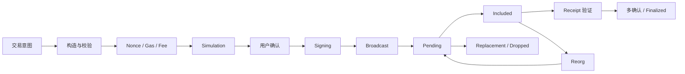
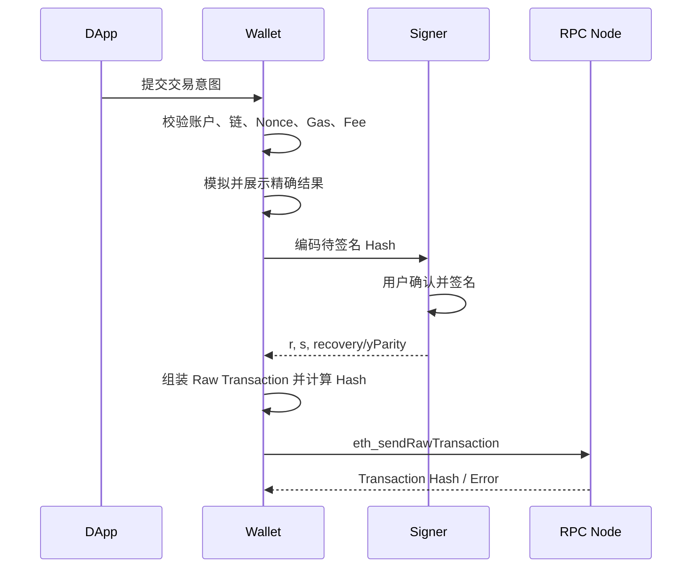
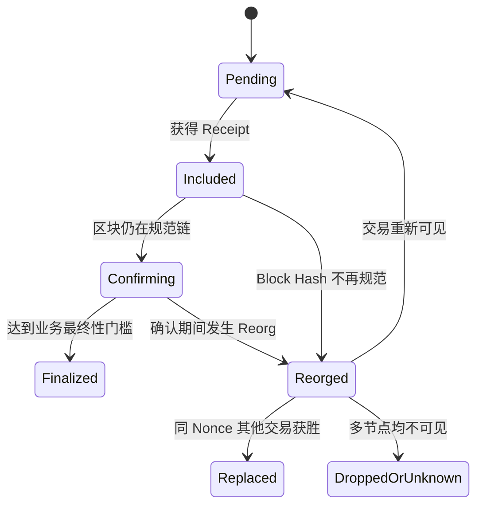
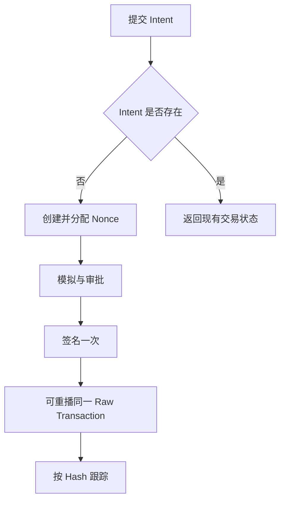

# Web3 Transaction Signing：从交易构造、Nonce 与 Gas 到广播、替换和最终确认

> 一笔交易被钱包签名，只能证明某个密钥授权了确定的交易字节；它不证明交易一定会广播、被打包、执行成功或永久留在规范链上。可靠的钱包必须把交易构造、模拟、签名、传播、替换、Receipt 和 Reorg 视为一条可回退的状态机。

---

## 一、本文解决什么问题

用户点击“确认”后，钱包通常要完成：

1. 确认账户和 Chain ID；
2. 读取或分配 Nonce；
3. 构造目标地址、金额和 Calldata；
4. 估算 Gas Limit；
5. 选择 Legacy 或 Typed Transaction；
6. 估算费用参数；
7. 模拟执行并解释风险；
8. 编码待签名 Payload；
9. 使用私钥签名；
10. 序列化并广播 Raw Transaction；
11. 跟踪 Mempool、Replacement 与区块收录；
12. 检查 Receipt Status；
13. 等待适合业务风险的确认；
14. 在 Reorg 后回退状态并继续跟踪。



本文覆盖大纲中的：

- Legacy Transaction
- Typed Transaction
- EIP-1559 Transaction
- Nonce Management
- Gas Estimation
- Simulation
- Signing
- Broadcast
- Replacement
- Confirmation
- Reorg Handling

### 核心结论

1. 交易签名绑定的是精确编码后的字段，不是钱包界面上的自然语言描述。
2. EIP-2718 Typed Transaction 用类型字节隔离不同交易格式；EIP-1559 动态费用交易是其中一种，不代表所有 Typed Transaction 都是 EIP-1559。
3. Nonce 是发送方账户交易顺序的一部分。多个进程共享账户时，单次 `getTransactionCount` 无法解决并发分配。
4. `eth_estimateGas` 是节点基于指定区块状态进行的一次估计，不保证未来实际执行一定成功，也不保证返回值等于最终 Gas Used。
5. Simulation 必须绑定账户、目标链、Value、Calldata 和尽可能接近执行时的区块状态；模拟成功不是安全证明。
6. 签名完成不等于广播成功，广播成功不等于进入 Mempool，进入 Mempool不等于被打包，被打包也不等于最终不可回滚。
7. Replacement 的核心是同一发送方、同一 Nonce 的竞争交易，但节点接受替换所需的费用提升属于客户端和节点策略，不能写死为协议常量。
8. Receipt `status = 1` 只表示该笔交易在当前区块上下文中没有回滚，不表示业务结果一定正确，也不表示不会发生 Reorg。

---

## 二、Ethereum 交易的稳定语义

### 2.1 交易是状态转换请求

外部拥有账户（EOA）签署交易后，网络验证发送者、Nonce、费用能力和签名，再由 EVM 执行相应消息调用或创建合约。

常见字段包括：

| 字段 | 作用 | 关键边界 |
|---|---|---|
| `chainId` | 绑定目标链 | 防止部分跨链重放，必须与钱包当前链一致 |
| `nonce` | 发送方交易序号 | 同一账户按 Nonce 顺序处理 |
| `to` | 接收地址 | 合约创建交易没有普通接收地址 |
| `value` | 转移的原生资产数量 | 单位是 Wei，不是 ETH 浮点数 |
| `data` | Calldata 或 Init Code | 决定合约方法和参数，可能携带任意授权 |
| `gasLimit` | 最多允许消耗的执行 Gas | 太低会 Out of Gas，未使用部分通常不被消耗 |
| 费用字段 | 约束每单位 Gas 支付 | 随交易类型不同 |
| `accessList` | 预声明访问的地址和 Storage Key | 用于 EIP-2930/相关 Typed Transaction |
| 签名字段 | 证明发送者授权 | 格式随交易类型而异 |

交易 Hash 通常是已签名序列化交易字节的 Keccak-256。修改任何被签字段都会产生不同交易和 Hash。

### 2.2 交易与内部调用

链上只有 EOA 发起的顶层交易使用账户 Nonce 和交易签名。合约在执行中产生的 `CALL`、`DELEGATECALL`、`STATICCALL` 等属于内部消息调用，不是新的签名交易，也没有独立交易 Hash。

因此区块浏览器展示的“Internal Transaction”通常是执行 Trace 的解释结果，不是共识层中的独立交易对象。

### 2.3 成功的三种含义

产品常把以下状态混成一个“成功”：

1. **Request Accepted**：钱包接受了签名或发送请求；
2. **Execution Succeeded**：Receipt `status` 表示顶层执行未回滚；
3. **Business Succeeded**：预期资产或合约状态确实发生正确变化。

例如 Token 合约可能返回非标准结果，批处理中的某个子调用可能允许失败，或者交易执行成功但成交价格已经超出用户预期。业务层必须验证事件和状态变化。

---

## 三、Legacy Transaction

### 3.1 基本字段

传统 Legacy Transaction 使用单一 `gasPrice`：

```text
nonce
gasPrice
gasLimit
to
value
data
v
r
s
```

交易使用 RLP（Recursive Length Prefix）编码。签名前 Payload 与签名后序列化结构需要按具体 EIP 规则构造，不能简单地“把 `v/r/s` 清零”。

### 3.2 EIP-155 Chain ID 保护

早期 Legacy 签名没有绑定 Chain ID，同一签名可能在采用相同账户规则的另一条链上重放。EIP-155 将 Chain ID 纳入签名计算，并通过 `v` 编码相关恢复信息。

工程上要注意：

- 不要根据签名长度猜 Chain ID；
- 不要手写 `v` 计算替代成熟库；
- 对历史交易解析要兼容未受 EIP-155 保护的旧格式；
- 新交易必须显式绑定预期 Chain ID；
- Chain ID 防重放不替代合约签名中的 Domain Separation。

### 3.3 `gasPrice` 的费用语义

Legacy 交易为每单位 Gas 提供统一价格。最终执行成本可近似表示为：

```text
execution cost = gasUsed * effectiveGasPrice
```

在支持 EIP-1559 的网络上，Legacy 交易仍可被执行，其 `gasPrice` 会同时约束 Base Fee 与给验证者/区块构建者的优先费用空间。具体纳入策略由网络与节点决定。

### 3.4 何时仍会遇到 Legacy

- 旧钱包、旧 SDK 或硬件签名设备；
- 不支持 EIP-1559 的 EVM 兼容网络；
- 历史交易解析；
- 特定基础设施只接受 Legacy Fee 字段。

钱包应按链能力和 Provider 能力选择，而不是默认“所有 EVM 网络都支持 Type 2”。

---

## 四、Typed Transaction

### 4.1 EIP-2718 的信封模型

EIP-2718 定义 Typed Transaction Envelope：交易以前导类型字节区分格式，后面跟该类型定义的 Payload。

```text
TransactionType || TransactionPayload
```

它解决的是交易格式扩展和类型隔离问题，使新格式不必继续向 Legacy RLP 列表追加字段。

常见类型包括：

| 类型 | 规范 | 主要用途 |
|---|---|---|
| Legacy | 历史格式 | `gasPrice` 交易，不属于 EIP-2718 Typed Envelope |
| Type 1 | EIP-2930 | Access List Transaction |
| Type 2 | EIP-1559 | Dynamic Fee Transaction |
| Type 3 | EIP-4844 | Blob-carrying Transaction，主要服务数据可用性场景 |

类型集合会随协议演进。钱包只应编码自身明确支持的类型，未知类型应拒绝或按透明 Raw Data 处理，不能误解析成 Type 2。

### 4.2 Type 1 Access List Transaction

EIP-2930 交易在 Legacy 风格 `gasPrice` 基础上增加 Chain ID 和 Access List 等字段。Access List 预声明交易将访问的账户与 Storage Key，使访问成本按协议规则计算。

它不是“列出所有调用过的合约”这么简单。错误或不完整的 Access List 通常不一定使交易失效，但会影响费用；具体 Gas 收益需要针对真实执行测量。

### 4.3 签名必须包含类型域

Typed Transaction 的签名 Hash 必须按该类型定义，包含类型字节和对应编码 Payload。否则相同字段可能在不同类型间产生签名混淆。

使用成熟库时也要防止字段与类型不一致：

- Type 2 不应同时携带 `gasPrice` 作为最终编码字段；
- Type 1/2 需要正确 Chain ID；
- Access List 结构必须规范化；
- 数值应使用整数或十六进制 Quantity，不能使用 JavaScript 浮点数；
- `to = null` 与空地址不是同一语义。

---

## 五、EIP-1559 Transaction

### 5.1 Type 2 字段

EIP-1559 动态费用交易常见字段：

```text
chainId
nonce
maxPriorityFeePerGas
maxFeePerGas
gasLimit
to
value
data
accessList
yParity
r
s
```

其中：

- `maxFeePerGas`：用户愿意为每单位 Gas 支付的总上限；
- `maxPriorityFeePerGas`：愿意支付的优先费用上限；
- Base Fee：由协议根据区块拥堵规则计算并销毁；
- 实际 `effectiveGasPrice` 由区块 Base Fee、费用上限和优先费用共同决定。

常见关系可概括为：

```text
priority fee paid = min(maxPriorityFeePerGas, maxFeePerGas - baseFeePerGas)
effectiveGasPrice = baseFeePerGas + priority fee paid
```

前提是 `maxFeePerGas` 足以覆盖区块 Base Fee。最终以执行客户端和 Receipt 数据为准。

### 5.2 Max Fee 不是预扣后全部消费

钱包可能按 `gasLimit * maxFeePerGas + value` 检查账户是否具备最坏情况下的资金能力，但最终费用根据实际 `gasUsed * effectiveGasPrice` 计算。未使用 Gas 和未达到上限的费用不会因为填写了 Max Fee 就全部支付。

界面应同时展示：

- 预计费用；
- 最大可能执行费用；
- 转账 Value；
- 总资金需求；
- 当前 Base Fee 与建议优先费的来源和时效。

### 5.3 Fee Estimation 不是简单加常数

费用策略应考虑：

- 当前和近期 Base Fee；
- 目标确认速度；
- 网络拥堵波动；
- 节点或费用服务数据质量；
- L2 的执行费用与 L1 Data Fee；
- Replacement 需要保留的上调空间；
- 用户愿意接受的费用上限。

不能把某个固定 Gwei 值写成所有网络、所有时期通用的“快速费”。

### 5.4 Base Fee 变化与 Pending

交易提交时可执行，不代表未来区块仍可执行。如果 Base Fee 上升到超过 `maxFeePerGas`，交易可能继续 Pending，直到 Base Fee 回落、交易被替换或节点丢弃。

因此 Pending 诊断必须比较当前 Base Fee 与交易费用上限，而不是只看优先费。

### 5.5 L2 费用边界

许多 Rollup 的用户总费用不只包含 EVM 执行 Gas，还包含向 L1 发布数据或其他协议成本。不同 L2 的估算 RPC、压缩规则和费用构成不同。

钱包应使用目标网络当前官方文档和受支持 SDK，不应只用 Ethereum Mainnet 的 `gasUsed * effectiveGasPrice` 解释用户总成本。

---

## 六、Nonce Management

### 6.1 Nonce 的作用

EOA 交易 Nonce 提供账户内顺序和重放保护。对同一发送者：

- Nonce 小于链上已消费值的交易会被拒绝；
- 高 Nonce 交易可能因前序缺口无法打包；
- 同一 Nonce 的多个交易互相竞争，最终规范链只能消费一次；
- 交易被 Reorg 移出后，Nonce 可能重新变为可用或交易重新进入 Pending。

### 6.2 `latest` 与 `pending`

查询交易数时常见两种区块标签：

- `latest`：基于当前规范链已确认状态；
- `pending`：节点尝试结合其本地 Pending Pool 计算。

`pending` 不是全球共识视图。不同 RPC 节点看到的 Mempool 不同，返回值也可能不同。负载均衡到多个节点时尤其容易分配重复 Nonce。

### 6.3 单进程 Nonce Manager

最小实现需要串行分配：

```typescript
class NonceManager {
  private nextNonce?: bigint;
  private queue = Promise.resolve();

  constructor(
    private readonly loadPendingNonce: () => Promise<bigint>,
  ) {}

  async reserve(): Promise<bigint> {
    let release!: () => void;
    const previous = this.queue;
    this.queue = new Promise<void>((resolve) => {
      release = resolve;
    });

    await previous;
    try {
      if (this.nextNonce === undefined) {
        this.nextNonce = await this.loadPendingNonce();
      }
      const reserved = this.nextNonce;
      this.nextNonce += 1n;
      return reserved;
    } finally {
      release();
    }
  }

  invalidate(): void {
    this.nextNonce = undefined;
  }
}
```

这只是单进程示例。它没有解决进程崩溃、广播失败、多个实例和 Replacement 的持久化协调。

### 6.4 分布式 Nonce 管理

服务端 Relayer 应维护持久化交易账本：

```text
account
nonce
intentId
unsignedPayloadHash
signedTransactionHash
rawTransaction reference
status
replacementOf
firstBroadcastAt
lastSeenAt
includedBlock
```

Nonce 分配需要数据库唯一约束、事务或单写者队列。不能让每个 Worker 独立向公共 RPC 查询后 `+1`。

### 6.5 广播失败时能否复用 Nonce

不能仅凭本地请求超时就判断交易未广播。RPC 可能已接收交易，只是响应丢失。安全做法：

1. 由已签名 Raw Transaction 本地计算 Transaction Hash；
2. 查询多个受信 RPC 是否已见该 Hash；
3. 检查账户 Pending/Latest Nonce；
4. 必要时重播完全相同的 Raw Transaction；
5. 只有确定原交易未传播或决定以同 Nonce 替换时，才构造新交易。

同一 Raw Transaction 重播是幂等传播，不会生成新的交易语义。

### 6.6 Nonce Gap

Nonce 10 长期 Pending 会阻塞同账户 Nonce 11、12 等交易。解决方式通常是：

- 提高 Nonce 10 原交易费用；
- 用同 Nonce 发送取消交易；
- 等待网络条件变化；
- 让节点重新获取缺失交易。

不能通过替换 Nonce 11 绕过 Nonce 10 的账户顺序。

---

## 七、Gas Estimation

### 7.1 `eth_estimateGas` 做了什么

节点在指定状态上下文中模拟交易，寻找足够执行的 Gas Limit。输入应尽可能完整：

```typescript
const gas = await provider.request({
  method: 'eth_estimateGas',
  params: [{
    from,
    to,
    value: toQuantity(value),
    data,
  }],
});
```

省略 `from`、`value` 或关键 Fee/State 信息，可能改变合约分支和估算结果。

### 7.2 估算成功不保证执行成功

估算与真正执行之间可能发生：

- 余额或 Allowance 变化；
- Oracle 价格变化；
- Deadline 到期；
- Nonce 被其他交易消费；
- 合约升级或参数调整；
- 区块时间、Base Fee、Coinbase 等环境变化；
- 前置交易改变 AMM 储备；
- Reorg 改变状态基础。

因此 Gas Estimate 不是未来执行证明。

### 7.3 估算失败不一定是 Gas 太低

`eth_estimateGas` 返回 Revert 时，常见原因是业务前置条件不满足，而不是应该继续增加 Gas Limit：

- Allowance 不足；
- Slippage 条件失败；
- 调用者没有权限；
- 合约已暂停；
- 参数编码错误；
- 余额不足；
- 目标方法本来就会 Revert。

钱包应解析标准化 Revert Data，并将“执行条件失败”与“RPC 不支持/超时”分开。

### 7.4 Gas Buffer

部分应用会在估算结果上增加 Buffer，以容纳状态轻微变化。但 Buffer 不能修复确定性 Revert，也不能盲目突破产品费用上限。

Buffer 比例应通过目标合约和网络实测确定，并设置绝对上限。对于用户可编辑 Gas Limit 的界面，要明确警告过低会导致 Out of Gas，而过高通常只是提高最大授权范围，不等于一定全部消费。

### 7.5 Out of Gas 与 Revert

两者都会使当前调用帧的状态变更回滚，但 Gas 消耗和错误诊断不同。Receipt 通常只给出顶层状态，详细根因需要节点 Trace 或在相同状态上复现。

不要仅从 `status = 0` 推断“Gas 不够”。

---

## 八、Simulation

### 8.1 Simulation 的目标

Simulation 不只是估算 Gas，还要回答：

- 顶层调用是否成功？
- 调用了哪些合约？
- Token、NFT 和原生资产如何变化？
- 是否创建长期 Allowance 或 Operator 权限？
- 是否发生代理升级、Owner 变更或任意调用？
- 用户预期输出与模拟输出是否一致？
- 是否存在未知合约、可疑 Delegatecall 或恶意回调？

### 8.2 模拟输入必须与签名输入一致

安全不变量：

```text
hash(normalized simulation intent)
    ==
hash(normalized signing intent)
```

至少核对：

- Chain ID；
- From、To、Value、Data；
- Nonce；
- Gas Limit 与费用字段；
- Access List；
- 交易类型；
- 相关区块状态标识。

如果 UI 模拟的是一笔交易，最终签名器却重新从可变表单读取字段，就存在 TOCTOU（检查与使用时差）风险。

### 8.3 `eth_call` 与 Trace

基础模拟可使用 `eth_call`，高级模拟可能依赖客户端 Debug/Trace API 或第三方服务。注意：

- Debug API 并非所有公共 RPC 都开放；
- Trace 格式存在客户端和服务商差异；
- Pending State 和 State Override 支持不一致；
- 第三方模拟服务可看到用户意图和地址隐私；
- 模拟器自身可能解析错误或落后于最新 Fork 规则。

高价值操作可以使用多个独立来源交叉验证，但最终仍需钱包清晰展示原始签名字段。

### 8.4 模拟成功仍可能被夹击或过期

AMM 交易模拟成功后，广播到公共 Mempool 可能遭遇抢跑、夹击或状态变化。需要合约级保护：

- Slippage Bound；
- Deadline；
- Minimum Output；
- Nonce/Permit Deadline；
- 私有交易通道的适用评估；
- 交易批处理的原子性设计。

模拟无法替代这些链上约束。

### 8.5 展示资产差异

钱包应优先展示用户能判断的结果：

```text
预计发送：1.00 ETH
预计收到：2,431 TOKEN
最少收到：2,400 TOKEN
新增授权：TOKEN 对 Router，额度 Unlimited
目标网络：Ethereum Mainnet
目标合约：已验证 Router 地址
```

自然语言描述必须由可验证字段生成，不能由 DApp 提供一段未绑定签名 Payload 的文案。

---

## 九、Signing

### 9.1 签名对象必须明确

钱包常见签名请求并不相同：

- 交易签名：授权链上状态转换；
- `personal_sign`：签署带前缀的任意消息；
- EIP-712 Typed Data：签署结构化消息；
- UserOperation/智能账户签名：由账户验证逻辑解释；
- EIP-1271 合约签名验证：结果由合约代码决定。

本篇讨论 EOA 交易签名。不能把消息签名结果直接当成 Raw Transaction 广播。

### 9.2 交易签名流程



私钥签名应由成熟 `secp256k1` 实现完成。随机 Nonce 生成、低 `s` 规范化、恢复位和序列化细节不应手写。

### 9.3 `eth_sendTransaction` 与本地签名

- `eth_sendTransaction`：把未签交易请求交给 Provider，由钱包管理账户、展示确认、签名并广播；
- 本地签名 + `eth_sendRawTransaction`：应用或签名服务自己构造并签署 Raw Transaction，再交给节点广播。

DApp 前端通常应让钱包 Provider 签名。后端 Relayer 才更常管理本地/HSM/MPC 签名。

### 9.4 Chain ID 必须在签名前冻结

如果用户在模拟后切链，旧 Payload 必须失效。签名前和签名后都应验证：

- 当前钱包 Chain ID；
- 交易编码内 Chain ID；
- 业务目标 Chain ID；
- RPC 广播目标网络。

把 Ethereum Mainnet 签名交易发送到测试网 RPC 通常不会成为有效的同一链交易，但错误路由仍应在广播前被拒绝，而不是依赖节点报错。

### 9.5 硬件钱包与 Blind Signing

硬件设备必须尽可能解析交易类型、Chain ID、To、Value 和 Calldata。新交易类型或复杂合约调用未被固件支持时，设备可能退化为 Blind Signing。

高价值场景中，不应把 DApp 页面显示视为可信替代。应使用可信设备屏幕、独立模拟、地址簿和审批策略共同确认。

### 9.6 Raw Transaction 属于敏感操作材料

已签 Raw Transaction 虽不暴露私钥，但任何人都可广播它。它应：

- 避免进入普通日志和前端 Analytics；
- 绑定 Intent ID 与审批记录；
- 设置最小访问权限和保留期；
- 在离线签名场景记录 Chain ID、Nonce 与有效业务窗口；
- 失效后检查是否仍可能被广播。

交易本身通常没有通用 Expiry 字段。需要时应由合约参数加入 Deadline，或通过 Nonce Replacement 使旧交易失效。

---

## 十、Broadcast

### 10.1 节点接受不等于全网传播

`eth_sendRawTransaction` 返回 Hash，通常表示该节点接受或已知交易。它不保证：

- 其他节点已经收到；
- 交易仍留在该节点 TxPool；
- 费用足以被打包；
- 前序 Nonce 已满足；
- 未来不会被 Replacement；
- 交易会在 Deadline 前执行。

### 10.2 本地计算 Hash

签名服务应在广播前从 Raw Transaction 本地计算预期 Hash，并核对 RPC 返回值。这样在请求超时或多 RPC 广播时仍可使用稳定 ID 跟踪。

如果 RPC 返回不同 Hash，应视为严重完整性异常并停止流程。

### 10.3 多 RPC 广播

向多个受信 RPC 重播完全相同 Raw Transaction 可以提高传播可靠性，但要考虑：

- Provider 隐私和地址关联；
- 不同节点 TxPool 策略；
- 重复广播的限流；
- 某些私有交易通道不应同时泄露到公共 Mempool；
- 返回错误可能只是“already known”。

多播不能修复无效签名、Nonce 太低或费用不足。

### 10.4 Pending、Dropped 与 Unknown

公共 RPC 查不到 Receipt 时，不能立即判断交易 Dropped。它可能：

- 仍在某些节点 Mempool；
- 尚未传播到当前 RPC；
- 已被同 Nonce 交易替换；
- 所在区块发生 Reorg；
- 节点清理了低费交易；
- 从未成功广播。

状态应建模为 `unknown/pending/replaced/included/reorged/dropped`，并结合多个证据判断。

---

## 十一、Replacement 与取消

### 11.1 Replacement 的本质

EOA 对同一 Nonce 只能在规范链消费一次。发送另一笔同发送方、同 Nonce、费用更有竞争力的交易，可以替换原 Pending 交易。

两种常见意图：

- **Speed Up**：保持 To、Value、Data 不变，提高费用；
- **Cancel**：同 Nonce 向自己发送零 Value/空 Data 交易，尝试抢先消费 Nonce。

“取消”只是竞争交易，不是撤回已经进入区块的交易，也不保证一定获胜。

### 11.2 节点 Replacement 策略

节点通常要求新交易费用字段相对旧交易有足够提升，但具体阈值、比较方式和 TxPool 策略会因执行客户端、版本、网络和节点配置变化。

因此：

- 不要把固定百分比写成 Ethereum 共识规则；
- EIP-1559 Replacement 通常需要同时合理提高费用上限和优先费；
- 某 RPC 接受不代表所有节点接受；
- 旧交易可能已传播到构建者，而新交易传播不足；
- Base Fee 变化会影响两笔交易的实际竞争力。

### 11.3 Replacement 状态关联

数据模型应保留同 Nonce 交易族：

```text
Account A, Nonce 42
  tx0: swap, original
  tx1: swap, speed-up of tx0
  tx2: self-transfer, cancel attempt
```

最终只能有一个在规范链成功消费 Nonce，但在 Reorg 前后不同成员可能短暂进入不同区块。UI 不应把 `tx1` 广播后立即把 `tx0` 标为永久失败。

### 11.4 Replacement Underpriced

出现 Replacement Underpriced 类错误时，应：

1. 查询原交易费用字段；
2. 查询当前 Base Fee 与费用建议；
3. 按目标 RPC/钱包策略重新计算；
4. 同时满足用户最大费用限制；
5. 防止重复按钮并发生成多个候选交易。

不能只增加 Gas Limit。Replacement 竞争主要取决于每单位 Gas 费用条件，而非 Gas Limit 数值。

### 11.5 已签交易的撤销边界

如果旧 Raw Transaction 已泄露但尚未执行，唯一通用链上对策通常是尽快用同 Nonce 的可信交易消费 Nonce。若旧交易使用未来 Nonce，还要逐个处理前序顺序和潜在交易队列。

合约层 Deadline、Nonce、可撤销授权和限额能缩小已签交易的有效窗口。

---

## 十二、Confirmation

### 12.1 Receipt 才是执行结果入口

交易进入区块后，Receipt 常见信息包括：

- `transactionHash`；
- `blockHash`、`blockNumber`；
- `status`；
- `gasUsed`、`effectiveGasPrice`；
- Logs；
- 合约创建地址等。

必须核对 Receipt 的 Transaction Hash、Block Hash 和目标链。只拿到区块号不足以防止同高度 Reorg 混淆。

### 12.2 `status = 1` 的边界

它表示顶层交易执行成功完成，但不保证：

- 每个子调用都成功，合约可能捕获失败；
- Token 一定按预期返回；
- 事件没有伪造或来自错误合约；
- 用户获得了预期最小资产；
- 交易经济结果合理；
- 区块不会被 Reorg。

业务确认应检查可信合约地址的事件与最终状态差异。

### 12.3 确认数不是统一安全常量

“等待 N 个区块”只是基于风险的策略。合理阈值取决于：

- 链的共识和最终性模型；
- 交易金额与可逆损失；
- 是否跨链或触发下游不可逆动作；
- 当前网络健康与 Reorg 风险；
- 应用对延迟的容忍；
- 是否有 `safe`、`finalized` 等受支持区块标签。

不能把某个确认数写成所有 EVM 链通用的绝对最终性。

### 12.4 UI 状态

推荐区分：

```text
AwaitingSignature
Signed
Broadcasting
Pending
Included
ExecutionFailed
Confirming
Finalized
Replaced
Reorged
DroppedOrUnknown
```

用户关闭页面后，后端或本地持久化任务仍应能继续跟踪。不能依赖一个组件中的轮询 Promise 作为唯一事实源。

### 12.5 业务幂等

后端收到“交易成功”回调时，需要以 `{chainId, transactionHash, logIndex}` 等稳定标识幂等处理，并验证：

- Receipt 位于当前规范链；
- 事件来自预期合约；
- Topic 和 Data 正确解码；
- 事件参数与业务订单匹配；
- 确认深度满足策略；
- Reorg 时可以撤销或补偿下游状态。

---

## 十三、Reorg Handling

### 13.1 什么是 Reorg

节点原先认为区块 A 是规范链的一部分，随后根据共识规则切换到另一条分支，A 及其后代可能被移出规范链。原区块中的交易可能：

- 在新分支重新被打包，Block Hash 改变；
- 回到 Mempool；
- 被同 Nonce 交易替代；
- 因状态变化而不再有效；
- 暂时查不到 Receipt。

### 13.2 Reorg 检测

跟踪器应保存 Receipt 的 `blockHash`，并定期验证：

```typescript
async function isReceiptCanonical(
  rpc: RpcClient,
  receipt: TransactionReceipt,
): Promise<boolean> {
  const canonicalBlock = await rpc.getBlockByNumber(receipt.blockNumber);
  return canonicalBlock?.hash === receipt.blockHash;
}
```

真实实现还要处理 RPC 延迟、节点不同步和区块暂不可用。可通过多个受信节点或最终性标签提高判断质量。

### 13.3 Reorg 状态回退



业务状态不能只前进不回退。Reorg 后需要撤销“已入账但未最终”的积分、订单、桥接消息或提现状态。

### 13.4 跨链场景风险更高

源链事件常触发目标链 Mint、Release 或消息执行。如果下游动作不可逆，源链确认策略必须与桥协议安全模型匹配。

不能只看前端显示的 Confirmations，还要理解：

- 消息协议验证的是区块、状态根还是验证者签名；
- 是否等待源链 Finality；
- 是否存在 Challenge Window；
- Relayer 失败如何重试；
- Reorg 后目标链是否有补偿机制。

### 13.5 RPC Reorg 与数据延迟误判

Receipt 暂时消失也可能是 RPC 节点落后或负载均衡节点状态不一致。诊断需要：

- 对比多个节点的 Head；
- 查询原 Block Hash；
- 查询同 Nonce 交易；
- 观察规范链父子关系；
- 区分节点同步故障与真实 Reorg。

---

## 十四、端到端交易状态机

### 14.1 状态定义

```typescript
type TransactionStatus =
  | { type: 'draft' }
  | { type: 'simulating' }
  | { type: 'awaiting-signature' }
  | { type: 'signed'; hash: `0x${string}` }
  | { type: 'broadcasting'; hash: `0x${string}` }
  | { type: 'pending'; hash: `0x${string}` }
  | { type: 'included'; receipt: TransactionReceipt }
  | { type: 'confirming'; receipt: TransactionReceipt; confirmations: bigint }
  | { type: 'finalized'; receipt: TransactionReceipt }
  | { type: 'execution-failed'; receipt: TransactionReceipt }
  | { type: 'replaced'; replacementHash: `0x${string}` }
  | { type: 'reorged'; previousBlockHash: `0x${string}` }
  | { type: 'dropped-or-unknown' }
  | { type: 'cancelled-by-user' }
  | { type: 'error'; error: TransactionFlowError };
```

### 14.2 数据持久化

至少保存：

```text
intentId
chainId
from
nonce
transactionType
normalizedUnsignedFields
simulationBlock
simulationResultHash
signedTransactionHash
broadcastAttempts
replacementFamily
receiptBlockHash
confirmationPolicy
currentStatus
```

不要持久化明文私钥。Raw Transaction 是否保存以及保存多久，要按重播和安全需求决定。

### 14.3 幂等提交

用户双击“发送”或网络重试时，应以 Intent ID 去重：



超时重试不能重新分配 Nonce 并生成不同业务交易，否则一次用户操作可能执行两次。

---

## 十五、常见错误案例

### 15.1 使用 JavaScript `number` 保存 Wei

大整数可能超过安全整数范围并发生精度丢失。应使用 `bigint` 或成熟大数类型，并在 UI 输入与链上整数间显式转换。

### 15.2 认为 Typed Transaction 就是 EIP-1559

EIP-2930、EIP-1559、EIP-4844 都可属于 Typed Envelope。解析必须先看类型字节。

### 15.3 每个 Worker 都读取 Pending Nonce

不同节点 Mempool 视图不同，多个 Worker 会拿到相同 Nonce。需要持久化分配和唯一约束。

### 15.4 Estimate 失败就把 Gas Limit 翻倍

如果根因是权限、余额、Slippage 或 Revert，增加 Gas 不会修复，只会掩盖错误诊断。

### 15.5 模拟后重新从表单拼交易

模拟与签名字段可能不同。应冻结规范化 Intent，并在签名前核对 Hash。

### 15.6 RPC 超时就发送新 Nonce

原交易可能已广播。应先本地计算 Hash并查询，再重播相同 Raw Transaction 或明确 Replacement。

### 15.7 提高 Gas Limit 来加速交易

Gas Limit 是执行上限，不是给打包者的每单位 Gas 报价。加速通常需要调整费用字段。

### 15.8 Cancel 交易广播后显示“已取消”

取消交易仍在与原交易竞争，只有它先在规范链消费同一 Nonce 后才能确认取消结果。

### 15.9 Receipt 出现就立即发放不可逆资产

区块可能发生 Reorg。必须按链与业务风险等待确认或 Finality，并支持状态回退。

### 15.10 `status = 1` 就相信任意事件

攻击合约可以发出同名事件。必须校验事件发出地址、Topic、参数和业务状态。

---

## 十六、工程方案选择

### 16.1 DApp 前端

适合让用户钱包通过 `eth_sendTransaction` 管理签名。DApp 负责：

- 构造明确 Intent；
- 校验 Chain 和 Account；
- 模拟和风险展示；
- 监听账户/链变化；
- 跟踪 Hash、Receipt 与 Reorg；
- 不接触私钥。

### 16.2 后端 Relayer

适合自动化或 Gas Sponsorship，但必须增加：

- HSM/MPC/隔离签名器；
- 分布式 Nonce Manager；
- Intent 幂等与审批；
- 目标合约、方法、金额和频率限制；
- 多 RPC 广播与交易跟踪；
- Replacement 和异常暂停机制。

### 16.3 智能账户

Account Abstraction 场景可能提交 UserOperation，而不是由用户直接发送普通 EOA 交易。其 Nonce、费用支付、验证与打包路径不同。

但最终 EntryPoint 或相关合约执行仍落到链上交易中。不能把 EOA Transaction、UserOperation 和 Bundle Transaction 混用同一状态字段而不标明层级。

### 16.4 私有交易通道

私有 Relay 或 Builder 通道可降低公共 Mempool 暴露和部分 MEV 风险，但会引入：

- 服务商可用性和审查风险；
- 隐私承诺边界；
- 未打包时是否回退公共 Mempool；
- Replacement 与取消语义；
- 多 Builder 传播策略。

需要按当前服务接口验证，不能假设“私有提交绝不会泄露”。

---

## 十七、测试与验证方法

### 17.1 编码测试向量

每种支持交易类型至少测试：

- Unsigned Payload 编码；
- Signing Hash；
- `r/s/yParity` 或 Legacy `v/r/s`；
- Raw Transaction；
- Transaction Hash；
- 解码后字段完全一致；
- 错误 Chain ID 和未知类型拒绝。

使用规范或成熟实现测试向量交叉验证，不能只做自编码、自解码闭环。

### 17.2 Nonce 并发测试

模拟：

- 100 个并发 Intent；
- Worker 在分配后崩溃；
- RPC 广播成功但响应超时；
- 多 RPC Pending Nonce 不一致；
- Replacement 与新交易同时到达；
- Reorg 使 Nonce 回退。

通过条件不是“没有报错”，而是每个业务 Intent 最多执行一次，并且每个 Nonce 的交易族可追踪。

### 17.3 Gas 与模拟差异测试

在本地 Fork 或测试网构造：

- 估算后余额改变；
- Deadline 过期；
- AMM 储备变化；
- 合约从正常切到暂停；
- Access Control 变更；
- Base Fee 快速变化；
- L2 Data Fee 变化。

验证 UI 是否要求重新模拟，而不是继续签署旧结果。

### 17.4 Replacement 测试

验证：

- 原交易低费 Pending；
- Speed Up 使用同 Nonce 和相同业务字段；
- Cancel 使用同 Nonce；
- 节点拒绝费用不足的替换；
- 原交易先打包时 UI 正确归并；
- 替换交易被 Reorg 后状态回退；
- 多个替换候选不会重复执行业务回调。

### 17.5 Reorg 测试

使用支持区块回滚的本地开发链，执行：

1. 广播交易并生成区块 A；
2. 记录 Receipt 与业务入账；
3. 回滚并生成不含该交易的竞争分支；
4. 验证交易状态从 Included 回到 Reorged/Pending；
5. 验证下游业务状态撤销；
6. 再次打包交易并验证幂等恢复。

### 17.6 性能测量

交易体验应测量：

- Fee/Gas 数据获取延迟；
- Simulation P50/P95/P99；
- 钱包确认耗时与用户取消率；
- Broadcast 接受延迟；
- 首次 Mempool 可见时间；
- Inclusion Time；
- 达到业务最终性时间；
- RPC 错误率和节点间 Head 差。

报告必须标明网络、RPC、时间窗口和交易类型。不要把某次测试的确认时间宣传为协议保证。

---

## 十八、上线检查清单

```text
[ ] 明确支持的交易类型和目标链能力
[ ] 所有金额与费用字段使用 bigint/大数类型
[ ] Chain ID 在模拟、签名和广播阶段一致
[ ] Nonce 由单一可靠组件持久化分配
[ ] 广播超时后先按本地 Hash 查询，不盲目创建新交易
[ ] Gas Estimate 包含完整 From、To、Value、Data
[ ] Estimate Revert 与 RPC 故障分开处理
[ ] Simulation 与最终签名字段可做规范化 Hash 核对
[ ] 用户能看到目标、金额、授权、网络和最大费用
[ ] Raw Transaction 不进入普通日志与 Analytics
[ ] RPC 返回 Hash 与本地计算 Hash 一致
[ ] Pending 状态支持 Speed Up、Cancel 和 Dropped 诊断
[ ] Replacement 阈值按节点策略动态处理，不写死为共识规则
[ ] Receipt 同时校验 Transaction Hash 与 Block Hash
[ ] 业务成功校验可信事件和状态，而不只看 status
[ ] 确认策略按链和业务风险配置
[ ] Reorg 会触发状态回退与下游补偿
[ ] 交易跟踪不依赖页面组件存活
[ ] 幂等键覆盖重复点击、网络重试和重复事件
[ ] 在 Fork 环境演练 Nonce Gap、Replacement 和 Reorg
```

---

## 十九、总结

Transaction Signing 是钱包交易流水线中的授权节点，而不是终点。

真正需要记住的是：

1. Legacy、EIP-2930、EIP-1559 等交易格式具有不同编码和费用字段，必须按类型精确解析与签名。
2. EIP-1559 的 `maxFeePerGas` 是上限，不等于最终全部支付；Pending 诊断还要考虑 Base Fee。
3. Nonce 是账户级共享顺序，生产 Relayer 必须集中、持久化地分配和追踪。
4. Gas Estimate 与 Simulation 都依赖特定状态快照，只能降低失败概率，不能证明未来执行结果。
5. 模拟、用户展示和最终签名字节必须绑定同一个不可变 Intent。
6. 广播超时不等于广播失败，重播相同 Raw Transaction 与创建新交易具有不同风险。
7. Replacement 和 Cancel 都是同 Nonce 交易竞争，节点费用提升策略不是固定共识常量。
8. Receipt Success 不是业务最终性；确认策略必须支持 Reorg 检测和状态回退。

成熟交易系统的标志，不是所有交易都能快速成功，而是每个中间状态、异常分支和链重组都能被准确解释、追踪和恢复。

---

## 问答复盘

### Q1：Typed Transaction 是否就是 EIP-1559 Transaction？

**答：** 不是。EIP-2718 定义类型化信封，EIP-2930 Type 1、EIP-1559 Type 2 和 EIP-4844 Type 3 都是不同类型；Legacy 则是历史格式。

### Q2：`maxFeePerGas` 设置为很高的值，是否会全部支付？

**答：** 通常不会。最终费用取决于实际 Gas Used 和区块中的 Effective Gas Price，但账户需要具备覆盖交易最坏资金需求的能力。

### Q3：为什么多个服务实例不能各自读取 `pending` Nonce 后发送交易？

**答：** 不同节点的 Mempool 视图不一致，并发实例也可能读取到同一值。必须由持久化 Nonce Manager 串行分配并记录交易族。

### Q4：`eth_estimateGas` 失败后增加 Gas Limit 能解决问题吗？

**答：** 不一定。失败常由权限、余额、Slippage 或合约 Revert 引起，增加 Gas 只对确实缺少执行 Gas 的情况有帮助。

### Q5：模拟成功为什么仍可能执行失败？

**答：** 模拟与执行之间的链上状态、时间、Base Fee、Oracle、余额和 AMM 储备都可能变化。必须用 Deadline、Slippage 等链上约束保护关键条件。

### Q6：RPC 广播请求超时后，为什么不能直接用下一个 Nonce 重发？

**答：** 节点可能已经接受原交易，只是响应丢失。应先用本地计算的 Hash 查询或重播相同 Raw Transaction，否则可能产生两笔有效业务交易。

### Q7：提高 Gas Limit 能加速 Pending 交易吗？

**答：** 通常不能。Gas Limit 是最大执行量，加速主要需要使用同 Nonce 提高费用竞争力，并满足节点 Replacement 策略。

### Q8：Cancel Transaction 为什么不能保证取消成功？

**答：** 它只是用同 Nonce 的另一笔交易与原交易竞争。原交易若先被打包，取消交易就无法撤回已经执行的结果。

### Q9：Receipt `status = 1` 是否足以给用户发放不可逆权益？

**答：** 不足。还要验证可信合约事件和业务状态，并按目标链与金额风险等待适当确认或最终性，处理潜在 Reorg。

### Q10：发生 Reorg 后交易一定失败吗？

**答：** 不一定。它可能回到 Mempool、在新分支重新打包、被同 Nonce 交易替换或变得无效。跟踪器必须回退状态并继续观察。

---

## 延伸知识

- **Key Management**：HD Wallet、硬件签名、Keystore、备份与密钥轮换。
- **Wallet Connection**：EIP-1193、WalletConnect、账户变化和 Chain Switching。
- **Account Abstraction**：UserOperation、Bundler、Paymaster、Nonce 与验证执行分离。
- **交易与最终性**：Mempool、区块传播、Fork Choice 和共识最终性。
- **签名安全**：EIP-712、Nonce、Deadline、Domain Separation 与跨链重放。
- **MEV 与私有交易**：抢跑、夹击、Builder、Bundle 和隐私传播边界。
