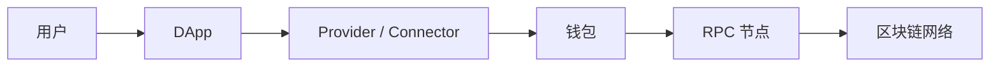
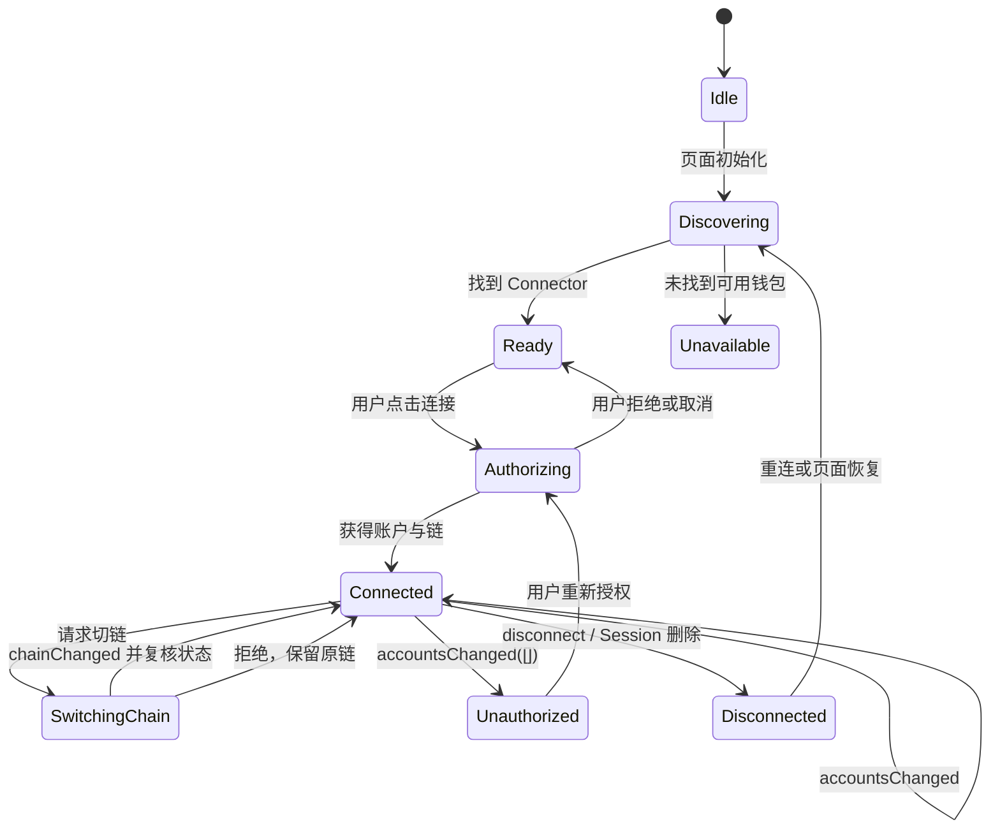
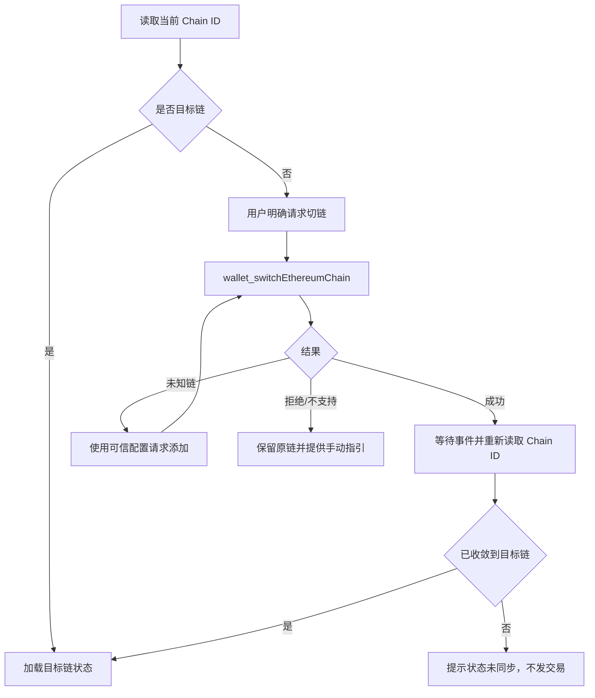
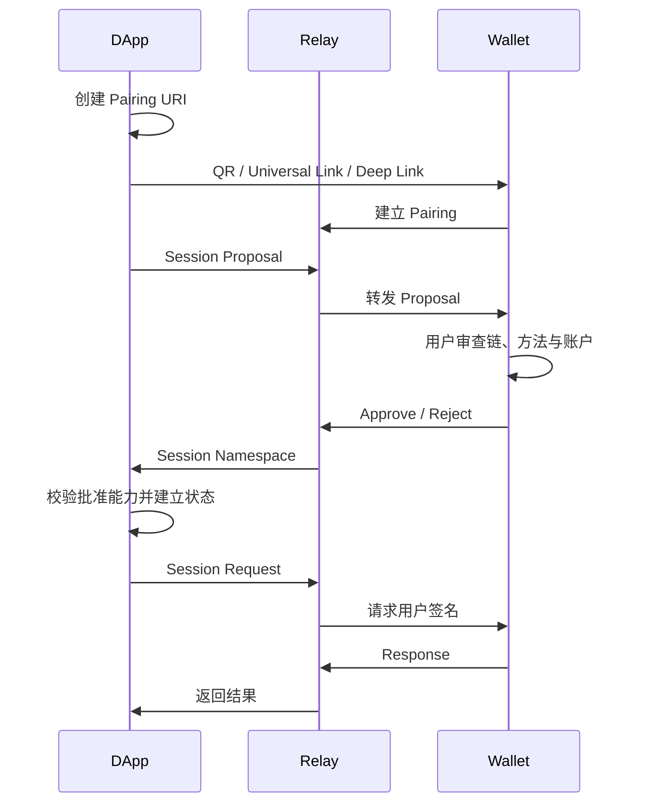
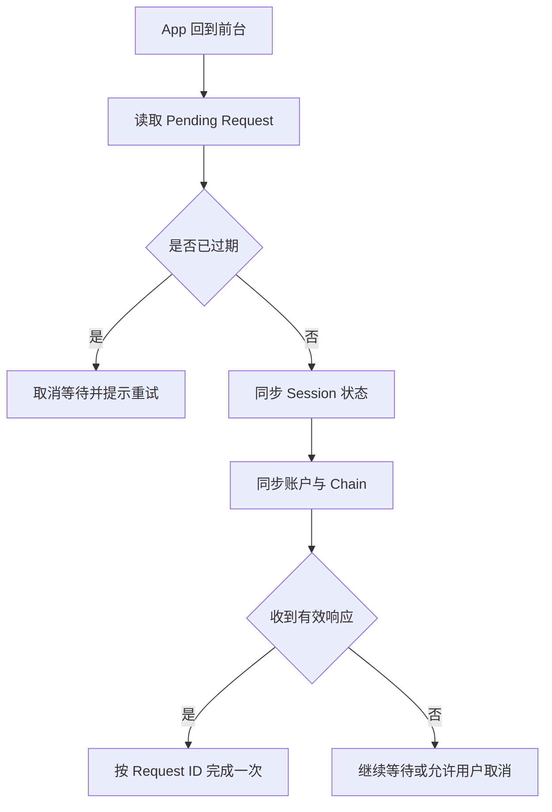
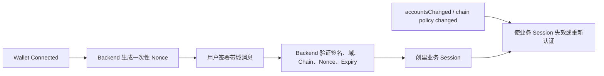

# Web3 Wallet Connection：从 EIP-1193、WalletConnect Session 到移动端 Deep Link

> “连接钱包”不是建立一个永久登录态，而是 DApp、Provider、钱包与链节点之间协商能力和授权的过程。Provider 可用不代表账户已授权，拿到账户不代表当前链正确，Session 存在也不代表远端钱包在线。工程上必须把连接、授权、链、账户和会话生命周期拆开管理。

---

## 一、本文解决什么问题

一个看似简单的“Connect Wallet”按钮，实际可能跨越多个系统：



任何一层状态变化都会影响界面：

- 浏览器里可能没有注入钱包，也可能有多个钱包同时注入；
- Provider 存在，但用户还没有授权账户；
- 用户已授权账户，但当前 Chain ID 不符合业务要求；
- WalletConnect Session 已保存，但手机钱包不可达或授权已过期；
- 用户在钱包中切换账户或网络，DApp 仍使用旧缓存；
- 前端“断开连接”，钱包侧授权却没有被真正撤销；
- 移动端 Deep Link 返回错误应用，或回调被恶意应用截获；
- 页面刷新后 Connector 自动恢复 Session，却在用户确认前发起签名。

本文覆盖大纲中的：

- Injected Provider
- EIP-1193
- WalletConnect
- Session
- Namespace
- Chain Switching
- Account Change
- Disconnect
- Deep Link
- Mobile Wallet

重点回答三个工程问题：

1. 如何建立准确、可恢复的连接状态机？
2. 如何处理账户、链、Session 与页面生命周期的异步变化？
3. 如何在桌面扩展、二维码和移动端跳转之间保持一致的安全边界？

### 核心结论

1. Provider 的“已连接”通常只表示能够向某条链提交 RPC 请求，不等于 DApp 获得了账户访问授权。
2. EIP-1193 是 Provider 接口约定，不是完整钱包 UI、登录协议或跨钱包会话标准。
3. `eth_accounts` 用于读取当前已授权账户，`eth_requestAccounts` 可能触发用户授权，应由明确用户操作发起。
4. 账户与链都可能在页面存活期间变化，必须订阅 `accountsChanged`、`chainChanged` 和 `disconnect`，并清理监听器。
5. WalletConnect 的 Pairing、Session、Namespace 与网络传输是不同层次；恢复本地 Session 不代表钱包当前在线。
6. Chain Switching 是钱包请求，不是强制命令；拒绝、未知链、钱包不支持和切换后状态尚未收敛都要单独处理。
7. 前端清空本地状态不一定撤销钱包授权。Injected Provider 没有统一的通用“断开并撤权”能力。
8. Deep Link 只是应用导航机制，不能作为身份认证。必须校验来源、回调参数、Session 绑定和最终账户状态。

---

## 二、连接钱包到底连接了什么

### 2.1 四类独立状态

钱包连接至少包含四个维度：

| 状态 | 典型问题 | 不能推出什么 |
|---|---|---|
| Provider 可用性 | 能否调用 `request()` | 不代表已授权账户 |
| RPC 连通性 | Provider 能否服务目标链请求 | 不代表钱包 UI 在线或已解锁 |
| Account Authorization | DApp 当前可见哪些账户 | 不代表用户已完成业务登录 |
| Session/Connector | 本地是否存在连接上下文 | 不代表链、账户和远端在线状态仍有效 |

业务认证还应是第五层。仅凭地址不能证明当前操作者控制私钥；需要通过一次带域、Nonce、过期时间的签名挑战验证，常见方案可参考 Sign-In with Ethereum（SIWE，EIP-4361）。

### 2.2 不要用一个布尔值表示全部状态

错误建模：

```typescript
type WalletState = {
  connected: boolean;
  address?: string;
};
```

它无法表达：Provider 已发现但未授权、Session 恢复中、网络错误、链不支持、账户为空、用户拒绝等状态。

更合理的最小模型：

```typescript
type ConnectionPhase =
  | 'idle'
  | 'discovering'
  | 'authorizing'
  | 'connected'
  | 'switching-chain'
  | 'disconnected'
  | 'error';

type WalletConnectionState = {
  phase: ConnectionPhase;
  connectorId?: string;
  providerAvailable: boolean;
  rpcConnected: boolean;
  accounts: readonly `0x${string}`[];
  chainId?: `0x${string}`;
  sessionId?: string;
  error?: WalletConnectionError;
};
```

`connected` 也不应成为所有操作的唯一门禁。发交易前仍需重新确认当前账户、Chain ID、权限和交易内容。

### 2.3 推荐状态机



关键点是事件可能乱序或重复。Reducer 应以最新读取结果收敛，而不是假设每个事件只发生一次。

---

## 三、Injected Provider

### 3.1 注入式钱包如何工作

浏览器扩展钱包通常向页面注入一个 Provider 对象。历史上很多 DApp 直接读取：

```typescript
const provider = window.ethereum;
```

Provider 将页面的 JSON-RPC 风格请求转交给扩展，由扩展执行权限检查、用户确认、签名或 RPC 转发。

需要明确：

- Provider 运行在不可信页面环境边界附近；
- DApp 不能读取钱包私钥；
- 钱包不应无条件信任 DApp 提供的交易描述；
- DApp 不能假设 Provider 始终属于某个特定钱包品牌；
- 页面脚本、扩展和 Provider 之间可能存在版本及兼容性差异。

### 3.2 多钱包发现

当多个扩展都注入 `window.ethereum` 时，最后写入或包装该对象的钱包可能不可预测。依赖私有字段识别品牌容易冲突或被伪造。

EIP-6963 定义了多注入 Provider 的发现机制，让钱包通过事件发布 Provider 信息，DApp 可以展示选择器。它是 Wallet Connection 的重要上游补充，但仍需保留旧式 Provider 的兼容策略。

工程原则：

- 使用成熟 Connector 层统一发现与兼容；
- Provider 信息只用于展示和路由，不作为安全身份凭证；
- 对钱包图标、名称和 RDNS 等元数据做安全渲染；
- 不让后发现的 Provider 静默替换已选择的连接；
- 连接后持有明确的 Provider 实例引用，不在每次请求时重新读全局对象。

### 3.3 不要在页面加载时弹授权

错误示例：

```typescript
// 错误：页面初始化即触发账户授权，缺少明确用户意图。
await window.ethereum.request({ method: 'eth_requestAccounts' });
```

这会造成弹窗骚扰，也可能被浏览器或钱包限制。初始化阶段应先读取无交互状态：

```typescript
const accounts = await provider.request({ method: 'eth_accounts' });
const chainId = await provider.request({ method: 'eth_chainId' });
```

只有用户点击“连接钱包”后，再调用可能触发授权的请求。

### 3.4 注入对象不是可信业务数据源

DApp 仍要验证 Provider 返回数据：

- `accounts` 是否为数组；
- 地址是否为合法 20-byte 十六进制值；
- `chainId` 是否为规范十六进制数量；
- 返回值是否属于产品支持网络；
- 事件数据是否需要通过主动查询复核。

连接钱包不会让页面环境变可信。XSS 一旦发生，攻击脚本可以借助现有授权发起签名请求。

---

## 四、EIP-1193 Provider 模型

### 4.1 最小接口

EIP-1193 的核心方法是：

```typescript
interface EIP1193Provider {
  request(args: {
    method: string;
    params?: readonly unknown[] | object;
  }): Promise<unknown>;

  on(event: string, listener: (...args: unknown[]) => void): this;
  removeListener(event: string, listener: (...args: unknown[]) => void): this;
}
```

稳定契约应以当前 EIP 和钱包文档为准。不同 SDK 可能包装为更强类型接口，但不要假设所有钱包支持同一组非标准方法。

### 4.2 `request()` 的职责

`request()` 接受 RPC Method 和参数，成功时返回方法结果，失败时拒绝 Promise。钱包相关常见请求包括：

```typescript
const chainId = await provider.request({ method: 'eth_chainId' });

const accounts = await provider.request({
  method: 'eth_requestAccounts',
});

const txHash = await provider.request({
  method: 'eth_sendTransaction',
  params: [{ from, to, value, data }],
});
```

参数结构由具体 RPC/EIP 决定，不是 EIP-1193 为所有方法统一定义。

### 4.3 错误分类

Provider 错误不应全部显示为“连接失败”。至少区分：

- 用户拒绝请求；
- 未授权访问所请求账户或方法；
- 方法不支持；
- 请求参数无效；
- Provider 与所有链断开；
- Provider 未连接到指定链；
- 钱包或 RPC 返回的业务错误。

EIP-1193 定义了 Provider Error 语义，并使用例如 `4001` 表示用户拒绝、`4100` 表示未授权、`4200` 表示方法不支持、`4900` 表示与所有链断开、`4901` 表示未连接到请求目标链。具体钱包还可能返回 JSON-RPC 或自定义错误，应用应保留原始 `code`、`message` 和安全筛选后的上下文用于诊断。

不要通过英文错误字符串判断逻辑分支。

### 4.4 核心事件

| 事件 | 含义 | DApp 动作 |
|---|---|---|
| `connect` | Provider 可服务某条链请求 | 重新读取 Chain ID 和账户 |
| `disconnect` | Provider 无法再服务 RPC 请求 | 禁用链上动作并进入重连流程 |
| `chainChanged` | Provider 当前 Chain ID 改变 | 取消旧链请求并重载链相关状态 |
| `accountsChanged` | 当前暴露账户集合改变 | 清空旧账户缓存和业务授权 |
| `message` | Provider 发出任意通知 | 按消息类型处理，不默认信任 |

`connect` 不是“用户已授权账户”的同义词。Provider 可以连接链，却返回空账户数组。

### 4.5 监听器生命周期

```typescript
function subscribeProvider(
  provider: EIP1193Provider,
  handlers: {
    onAccountsChanged(accounts: unknown): void;
    onChainChanged(chainId: unknown): void;
    onDisconnect(error: unknown): void;
  },
): () => void {
  provider.on('accountsChanged', handlers.onAccountsChanged);
  provider.on('chainChanged', handlers.onChainChanged);
  provider.on('disconnect', handlers.onDisconnect);

  return () => {
    provider.removeListener('accountsChanged', handlers.onAccountsChanged);
    provider.removeListener('chainChanged', handlers.onChainChanged);
    provider.removeListener('disconnect', handlers.onDisconnect);
  };
}
```

React 组件中应在 Effect Cleanup 调用返回函数，并确保 Handler 引用稳定。重复订阅会造成一次切链触发多次状态更新和重复请求。

---

## 五、账户授权与 Account Change

### 5.1 `eth_accounts` 与 `eth_requestAccounts`

两者目的不同：

- `eth_accounts`：读取当前已允许 DApp 访问的账户，不应主动弹出授权；
- `eth_requestAccounts`：请求账户访问，可能展示钱包 UI，应由用户手势触发。

示例连接流程：

```typescript
async function requestWalletAccounts(
  provider: EIP1193Provider,
): Promise<readonly `0x${string}`[]> {
  const result = await provider.request({ method: 'eth_requestAccounts' });

  if (!Array.isArray(result)) {
    throw new Error('Wallet returned an invalid accounts payload');
  }

  return result.map(parseEthereumAddress);
}
```

生产代码应避免并发调用多个授权请求。连接按钮在请求进行中需要禁用或复用同一 Promise。

### 5.2 空账户数组意味着什么

`accountsChanged([])` 通常表示当前没有暴露给 DApp 的账户，例如用户锁定钱包、撤销权限或移除账户。DApp 应：

1. 立即停止使用旧地址；
2. 清理账户相关缓存、签名挑战和草稿交易；
3. 将业务身份标记为未认证；
4. 保留 Provider/Connector 状态，以便用户重新授权；
5. 不自动反复弹出账户请求。

它不一定等于 Provider RPC 断开。

### 5.3 账户切换必须使缓存失效

账户从 A 切到 B 时，下列状态不能复用：

- Token 余额与 Allowance；
- ENS/头像和地址标签；
- Nonce 与待签交易；
- SIWE 登录 Session；
- 用户权限与后端访问令牌；
- Portfolio、仓位和历史记录；
- Permit、Typed Data 和未完成审批；
- 本地保存的交易表单中 `from` 字段。

推荐将缓存 Key 至少包含：

```text
connectorId + chainId + normalizedAccount
```

并在事件后主动读取 `eth_accounts` 与 `eth_chainId` 收敛状态，防止依赖陈旧事件参数。

### 5.4 地址比较

Ethereum 地址在协议层是 20-byte 值。应用比较时应解析并规范化，而不是直接比较用户输入字符串的大小写。展示时可以使用校验和编码，但不能把大小写差异误判为两个账户。

---

## 六、Chain Switching

### 6.1 Chain ID 是连接上下文的一部分

同一个 EOA 地址可出现在多个 EVM 网络上，但余额、Nonce、合约地址和授权完全独立。所有链相关查询都应显式绑定 Chain ID。

不要通过网络名称判断身份，应使用 `eth_chainId` 返回的 Chain ID。还要注意：相同 Chain ID 的恶意或错误 RPC 会造成网络冒充风险，重要操作可校验已知合约代码、区块信息和 RPC 配置。

### 6.2 请求切换网络

支持相关钱包方法时，可请求：

```typescript
await provider.request({
  method: 'wallet_switchEthereumChain',
  params: [{ chainId: '0x1' }],
});
```

该方法由 EIP-3326 描述。它是请求，不保证钱包一定支持或用户一定同意。

常见结果：

- 用户确认并切换；
- 用户拒绝；
- 钱包不支持该方法；
- 目标链尚未添加；
- 请求完成但 `chainChanged` 到达时间不同；
- 移动钱包切换后需要返回 DApp 才继续流程。

### 6.3 添加未知网络

部分钱包在未知 Chain ID 时支持 EIP-3085 的 `wallet_addEthereumChain`：

```typescript
await provider.request({
  method: 'wallet_addEthereumChain',
  params: [{
    chainId: targetChain.chainId,
    chainName: targetChain.name,
    nativeCurrency: targetChain.nativeCurrency,
    rpcUrls: targetChain.rpcUrls,
    blockExplorerUrls: targetChain.explorerUrls,
  }],
});
```

网络元数据必须来自应用维护的可信配置，不能直接接受 URL 参数或第三方接口返回的任意 RPC。恶意 RPC 可以隐藏交易、伪造查询结果或误导用户。

### 6.4 正确的切链流程



不要在 `wallet_switchEthereumChain` Promise Resolve 后立即用旧 Provider 缓存构造交易。最终门禁应再次读取并验证 Chain ID。

### 6.5 切链时取消旧请求

切链会让以下异步结果失效：

- 余额和 Token Metadata；
- Gas Estimate 与 Fee Data；
- Contract Read；
- 交易模拟；
- ENS 或链特定名称解析；
- 后端基于 Chain ID 返回的报价；
- 待签交易草稿。

使用请求版本号或 `AbortController`，只提交当前 `{chainId, account}` 对应的结果。

---

## 七、WalletConnect

### 7.1 为什么需要 WalletConnect

桌面网页无法直接访问手机钱包的注入 Provider。WalletConnect 提供钱包与 DApp 之间的会话通信协议，使双方可通过二维码、Universal Link 或 Deep Link 建立连接，并通过 Relay 等基础设施交换加密消息。

它不是区块链节点，也不替代链上 RPC。具体 SDK 版本、支持链和方法应以当前 WalletConnect 官方文档与钱包能力为准。

### 7.2 Pairing 与 Session 不同

概念上可区分：

- **Pairing**：建立两个客户端之间可继续协商的通信关系；
- **Session Proposal**：DApp 提出所需链、账户命名空间、方法和事件；
- **Session Approval**：钱包批准实际 Namespace 与账户；
- **Session**：双方后续请求、响应和事件的授权上下文；
- **Session Request**：在已批准能力范围内请求签名或其他方法。



本地存在 Pairing 不代表已获得账户授权；Session 过期或删除后，Pairing 也可能仍有独立生命周期。

### 7.3 URI 是敏感连接材料

WalletConnect URI/二维码包含建立 Pairing 所需信息。它不等同于私钥，但在有效期内泄露可能造成错误客户端抢先配对、会话混淆或隐私问题。

应用应：

- 使用短生命周期并及时关闭过期二维码；
- 不写入 Analytics、日志或截图系统；
- 防止旧 URI 被重复展示；
- 新建连接时取消旧的 Pending Proposal；
- 在 UI 显示当前请求来源和 DApp Identity；
- 扫码后仍由钱包展示并确认权限。

### 7.4 Session 恢复不等于在线

刷新页面后，SDK 可能从持久化存储恢复 Session。此时只能说明本地有一份未过期上下文，还需要验证：

- Session 是否已过期；
- Namespace 是否仍包含目标链和方法；
- 账户是否仍符合当前业务；
- Wallet 是否可通过 Relay 到达；
- Session 是否已被远端删除但本地尚未同步；
- DApp 版本是否仍兼容该 Session。

UI 可以显示“正在恢复连接”，不能立即假设钱包在线并弹出签名。

---

## 八、Session 与 Namespace

### 8.1 Namespace 表达授权能力

WalletConnect v2 风格 Namespace 使用 CAIP-2/CAIP-10 等链与账户标识表达多链能力。以 EVM Namespace 的概念示例：

```json
{
  "eip155": {
    "accounts": [
      "eip155:1:0x1111111111111111111111111111111111111111",
      "eip155:137:0x1111111111111111111111111111111111111111"
    ],
    "methods": [
      "eth_sendTransaction",
      "personal_sign"
    ],
    "events": [
      "accountsChanged",
      "chainChanged"
    ]
  }
}
```

这只是结构示意。实际字段、提案方式和 SDK API 应以正在使用的 WalletConnect 版本文档为准。

### 8.2 Required 与 Optional 能力

DApp 应只把无法运行的最小能力放入 Required Namespace，其余放入 Optional。请求过多链和方法会：

- 增加用户理解成本；
- 降低钱包兼容性；
- 扩大 Session 被滥用的能力面；
- 使 Proposal 更容易被拒绝。

权限设计应遵循最小权限。例如只读页面不应在首次访问就要求交易签名方法。

### 8.3 使用前再次校验 Namespace

每次发起 Session Request 前校验：

```text
[ ] Session 未过期且未删除
[ ] 目标 Namespace 存在
[ ] 目标 Chain ID 已获批准
[ ] 请求 Method 已获批准
[ ] 发起账户属于该链批准账户集合
[ ] 当前 UI 展示的账户与请求账户一致
[ ] 请求没有复用旧页面或旧链的 Pending State
```

不能只在连接成功时校验一次。

### 8.4 Session Update 与事件

钱包可能更新 Namespace、账户或链。DApp 收到更新后应以新授权集合为准，并使旧缓存失效。更新过程要处理：

- 新 Session 数据比旧请求晚到；
- Pending 签名基于已被移除的账户；
- 当前选中链不再获批准；
- 多标签页同时写入 Session Store；
- SDK 的本地事件与远端事件重复。

建议集中由一个 Connection Store 串行处理事件，而不是让每个页面组件直接修改 Session。

---

## 九、Disconnect 的语义边界

### 9.1 三种“断开”不是一回事

| 操作 | 本地状态 | 钱包/Session | 已签授权 |
|---|---|---|---|
| 清空 DApp 缓存 | 删除前端选中账户 | 可能仍存在 | 不会自动撤销 |
| 删除 WalletConnect Session | 本地和远端会话结束 | 通常通知对端 | 链上 Allowance/Permit 仍可能有效 |
| 钱包撤销站点权限 | Provider 不再暴露账户 | 由钱包控制 | 链上授权仍可能有效 |

用户点击“Disconnect”时，产品必须明确承诺的是哪一种。

### 9.2 Injected Provider 没有统一断开 API

EIP-1193 没有定义一个适用于所有注入钱包、可由 DApp 强制撤销账户授权的通用 Disconnect 方法。部分钱包提供权限相关 RPC，但兼容性和语义需要按钱包验证。

因此 DApp 的 Disconnect 通常至少要：

- 清空本地 Connector、账户和 Chain 状态；
- 删除业务登录 Token 和签名挑战；
- 停止订阅与轮询；
- 取消 Pending 请求；
- 告知用户如需彻底撤权，应在钱包权限设置中操作。

不要在刷新页面后通过 `eth_accounts` 又静默恢复为“已登录”，除非产品明确支持并正确恢复了业务认证。

### 9.3 WalletConnect Session 删除

WalletConnect Connector 通常可以发起 Session Disconnect，并携带协议定义的原因。实现需处理：

- 对端离线时本地先删除；
- Disconnect 消息重复；
- Session 已过期或不存在；
- 多标签页收到同一删除事件；
- 本地清理失败但远端已删除；
- 断开后残留 Pairing。

清理操作应幂等。同一个 Session 删除事件执行多次，不应抛出不可恢复错误。

### 9.4 Disconnect 不撤销链上授权

钱包连接断开不会撤销：

- ERC-20 Allowance；
- NFT Operator Approval；
- Permit 已签名授权；
- 智能账户 Session Key；
- 合约 Role；
- 已广播或排队的交易。

如果产品提供“撤销授权”，必须生成明确的链上交易或调用协议撤销入口，并向用户说明 Gas、确认和失败状态。

---

## 十、Deep Link 与 Mobile Wallet

### 10.1 为什么移动端更复杂

移动浏览器与钱包通常是两个独立 App。连接或签名需要：

1. DApp 创建连接或请求；
2. 系统打开钱包 App；
3. 用户在钱包确认；
4. 钱包通过 Relay 返回结果；
5. 系统可选地跳回 DApp；
6. DApp 从后台恢复并重新同步状态。

应用切换不是原子流程，任一 App 都可能被系统终止。

### 10.2 Universal Link 优先于自定义 Scheme

自定义 URL Scheme 容易被其他应用注册并截获。Universal Link/App Link 通过域名关联提高目标应用绑定能力，通常更适合安全跳转，但仍需正确配置平台关联文件、域名和回退策略。

无论使用哪种方式，都不能只因为某 URL 打开了目标界面就认为请求来自可信钱包。

### 10.3 回调校验

回到 DApp 后应依据原 Session/Request ID 查询实际协议结果，而不是信任 Deep Link 查询参数中的“success=true”。至少绑定：

- 随机 Request ID 或 State；
- Session Topic/ID；
- 发起时间和过期时间；
- 预期钱包/Connector；
- 目标 Chain ID；
- 预期账户与 Method；
- 一次性消费状态。

Deep Link 负责导航，Relay/Provider 返回的加密协议响应负责结果，最终链上状态负责交易事实。

### 10.4 App 生命周期

移动 DApp 在后台恢复时应：



不要在每次 `visibilitychange` 或 App Resume 时重新发起签名，否则可能产生多个钱包弹窗和重复交易。

### 10.5 移动端 Deep Link 常见失败

- 钱包未安装；
- 系统浏览器阻止无用户手势跳转；
- URI 过长或编码错误；
- 钱包打开后 Session Proposal 已过期；
- 用户确认后没有自动返回 DApp；
- DApp 进程被杀死，Pending Request 只存在内存；
- 多个钱包竞争同一自定义 Scheme；
- In-app Browser 与系统浏览器拥有不同存储和返回行为。

产品必须允许用户手动返回，并通过持久化 Request ID 恢复流程。

### 10.6 移动钱包内置浏览器

部分钱包提供 In-app DApp Browser，页面可能获得注入 Provider。这减少 App 切换，却带来新的兼容边界：

- WebView Provider 与桌面扩展行为可能不同；
- 页面刷新、进程回收和存储策略不同；
- 键盘、安全区域和权限弹窗影响交互；
- User Agent 识别不可靠；
- Deep Link 可能再次打开同一钱包或产生循环。

应基于能力检测选择 Connector，而不是仅根据 User Agent 判断。

---

## 十一、连接状态管理实现

### 11.1 单一 Connection Store

连接状态应由应用级 Store 管理，页面组件只消费状态和发出意图：

```typescript
type WalletAction =
  | { type: 'DISCOVERY_STARTED' }
  | { type: 'AUTHORIZATION_STARTED'; connectorId: string }
  | { type: 'SNAPSHOT_RECEIVED'; snapshot: WalletSnapshot }
  | { type: 'ACCOUNTS_CHANGED'; accounts: readonly `0x${string}`[] }
  | { type: 'CHAIN_CHANGED'; chainId: `0x${string}` }
  | { type: 'SESSION_DELETED'; sessionId: string }
  | { type: 'DISCONNECTED'; reason?: unknown }
  | { type: 'FAILED'; error: WalletConnectionError };
```

所有事件应带 Connector/Session 世代标识。旧 Connector 的迟到事件不能覆盖新连接。

### 11.2 防止连接竞态

典型竞态：

1. 用户点击 Wallet A；
2. A 的授权请求等待中；
3. 用户改选 Wallet B；
4. B 先成功；
5. A 随后返回并覆盖当前账户。

可以使用 Generation Token：

```typescript
let connectionGeneration = 0;

async function connect(connector: WalletConnector): Promise<void> {
  const generation = ++connectionGeneration;
  setState({ phase: 'authorizing', connectorId: connector.id });

  try {
    const snapshot = await connector.connect();
    if (generation !== connectionGeneration) return;
    commitSnapshot(connector.id, snapshot);
  } catch (error) {
    if (generation !== connectionGeneration) return;
    handleConnectionError(error);
  }
}

function cancelCurrentConnection(): void {
  connectionGeneration += 1;
}
```

Connector 自身支持取消时还应释放 Proposal、二维码和监听器。

### 11.3 Snapshot 收敛

事件只表示“可能发生变化”，最终状态应通过 Connector 的统一 Snapshot 读取：

```typescript
type WalletSnapshot = {
  accounts: readonly `0x${string}`[];
  chainId: `0x${string}`;
  sessionId?: string;
  rpcConnected: boolean;
};
```

一次 Snapshot 应尽量来自同一个 Provider/Session 世代。读取过程中若发生切链，可丢弃结果并重试。

### 11.4 业务登录与钱包连接分离

推荐数据流：



后端不能接受可重复使用的固定“登录消息”。签名消息应绑定域名、URI、Nonce、时间和适用 Chain 等上下文，并按采用标准验证。

---

## 十二、错误处理与用户体验

### 12.1 错误必须可行动

| 场景 | 用户提示 | 应用动作 |
|---|---|---|
| 未安装钱包 | 提供可信安装入口或二维码连接 | 保留页面状态 |
| 用户拒绝 | 表示请求已取消 | 不自动重试 |
| 未授权 | 提示重新授权账户 | 清理旧账户 |
| 链不支持 | 提供支持网络列表 | 禁止交易 |
| 未知链 | 经用户操作请求添加可信网络 | 不使用外部 RPC 参数 |
| Session 过期 | 提示重新连接 | 清理 Session |
| Wallet 离线 | 保留可取消等待状态 | 允许重连 |
| RPC 故障 | 区分钱包连接与数据服务故障 | 切换受信 RPC 或稍后重试 |

不要把所有错误吞掉后只显示“Something went wrong”。同时也不要把原始 RPC Error、节点 URL 或内部堆栈完整暴露给普通用户。

### 12.2 用户拒绝不是系统故障

拒绝连接、切链或签名是正常控制流。它通常不应上报为高优先级异常，也不应触发自动重试。埋点应区分：

- User Cancel；
- Compatibility Failure；
- Transport Failure；
- Provider/RPC Failure；
- Application Validation Failure。

### 12.3 Pending UI

移动连接和签名可能需要较长交互。界面应稳定显示：

- 当前目标钱包；
- 正在请求的动作；
- 是否需要切换到钱包 App；
- 取消入口；
- Request 过期后的重新发起入口。

但不应在可见文案中要求用户输入助记词或私钥。正规连接流程从不需要 DApp 获取这些材料。

---

## 十三、安全边界

### 13.1 Wallet Connection 不等于可信身份

前端收到地址只能说明钱包当前暴露了该账户，不能直接证明某个后端请求由地址控制者发起。业务登录必须验证签名，并防止：

- Nonce 重放；
- 跨域重放；
- 跨 Chain 重放；
- 过期消息复用；
- 地址大小写和编码错误；
- EIP-1271 智能合约账户验证遗漏；
- Session 在 `accountsChanged` 后继续有效。

### 13.2 XSS 是钱包连接的高危威胁

攻击脚本通常读不到私钥，但可以：

- 替换收款地址；
- 发起恶意签名请求；
- 伪造交易说明；
- 窃取 SIWE Session；
- 替换 WalletConnect URI；
- 劫持 Deep Link 回调状态。

因此需要 CSP、依赖锁定、供应链审计、可信构建、避免危险 HTML 注入，并让钱包独立展示关键签名字段。

### 13.3 Provider 与 RPC 都是不可信边界

DApp 应对高价值操作进行独立验证：

- Chain ID 和目标合约；
- 合约 Code Hash 或可信部署清单；
- 交易模拟来源；
- RPC 返回的余额、Nonce 和 Receipt 一致性；
- 广播后的 Transaction Hash 与签名字节；
- 确认深度和 Reorg。

Wallet Connection 只建立请求通道，不保证返回的链数据绝对正确。

### 13.4 最小权限 Session

不要为了未来可能使用而一次申请所有链、方法和事件。Session 权限越大：

- 用户越难理解；
- 钱包兼容性越差；
- DApp 被攻陷后的可利用面越大；
- 审计越难证明请求符合业务范围。

---

## 十四、常见错误案例

### 14.1 `window.ethereum` 存在就显示“已连接”

Provider 可用不等于账户已授权。应读取账户、链和 RPC 状态分别展示。

### 14.2 页面加载自动调用 `eth_requestAccounts`

这会制造弹窗骚扰。初始化使用 `eth_accounts`，授权必须由用户动作触发。

### 14.3 只处理首次连接，不监听事件

用户切换账户或链后，DApp 会继续用旧地址构造交易。必须订阅并清理事件监听器。

### 14.4 `chainChanged` 后只改 UI 标签

余额、合约、Gas、Nonce、报价和模拟都属于旧链缓存，应整体失效并重新加载。

### 14.5 切链 Promise 成功后立刻发送交易

Provider 状态可能尚未收敛。发送前必须重新读取并验证 Chain ID。

### 14.6 把 WalletConnect Pairing 当 Session

Pairing 只提供后续协商通道，不能证明账户和方法已授权。必须以批准后的 Session Namespace 为准。

### 14.7 刷新后恢复 Session 就自动签名

本地 Session 可能过期、远端删除或钱包离线。恢复后先同步状态，签名仍应由新的用户意图触发。

### 14.8 Disconnect 只清空地址变量

监听器、业务 Token、Pending Request 和 Session 仍可能存在。断开流程必须幂等清理完整资源。

### 14.9 信任 Deep Link 的成功参数

Deep Link 只能导航。结果必须与原 Request ID 和协议响应匹配，并最终核对链上状态。

### 14.10 用 Wallet Connection 代替登录验证

地址可见不等于后端请求已认证。需要一次性签名挑战和服务端验证。

---

## 十五、测试与验证方法

### 15.1 Provider Contract Test

为 Connector 建立统一契约测试：

```text
[ ] 未授权时 accounts 为空
[ ] 用户拒绝连接后状态回到可重试
[ ] accountsChanged 能清除旧账户缓存
[ ] chainChanged 能取消旧链请求
[ ] disconnect 后链上操作被禁用
[ ] 重复事件不会重复注册资源
[ ] 组件卸载后监听器被移除
[ ] 旧 Connector 迟到结果不能覆盖新连接
```

使用 Fake Provider 主动制造乱序、重复和非法 Payload，不要只在真实钱包 Happy Path 上测试。

### 15.2 多钱包兼容矩阵

至少记录：

- 桌面扩展；
- 桌面二维码连接手机钱包；
- 移动系统浏览器 + Deep/Universal Link；
- 钱包内置浏览器；
- iOS 与 Android；
- 支持与不支持目标切链方法的钱包；
- 多 Provider 同时注入；
- 钱包锁定、离线和升级场景。

兼容性结论必须注明钱包和 SDK 版本、平台及测试日期，因为内部行为会变化。

### 15.3 WalletConnect 故障注入

覆盖：

- Proposal 超时；
- 用户拒绝 Namespace；
- Session 刚批准就断网；
- Relay 暂时不可达；
- 远端删除 Session；
- Session Update 移除当前链；
- 请求响应晚于页面取消；
- 页面刷新和 App 被系统终止；
- 同一账户多个 Session 并存。

### 15.4 移动端生命周期测试

真实设备执行：

1. 发起连接后切到钱包；
2. 在确认前杀死 DApp；
3. 重新打开 DApp；
4. 验证 Pending Request 是否能安全恢复或过期；
5. 再次确认不会生成重复请求；
6. 手动返回而非自动 Deep Link；
7. 钱包未安装时验证回退路径。

### 15.5 安全测试

- 修改 Deep Link `state` 和 Request ID，必须拒绝；
- 使用不受支持 Chain ID，交易按钮必须禁用；
- 注入伪造账户、非法地址和异常 Provider Error；
- 替换 WalletConnect URI，UI 必须能发现 Session 不匹配；
- `accountsChanged` 后旧 SIWE Token 必须按策略失效；
- XSS 测试中敏感 Session Token 不应暴露给不必要存储；
- Disconnect 后链上 Allowance 不应被错误显示为已撤销。

---

## 十六、上线检查清单

```text
[ ] 使用 Connector 抽象管理 Injected 与 WalletConnect
[ ] 支持多 Provider 发现或有明确兼容策略
[ ] 页面初始化不主动弹出账户授权
[ ] 区分 Provider、RPC、Account、Session 和 Auth 状态
[ ] accountsChanged、chainChanged、disconnect 均已订阅
[ ] 监听器、二维码、Proposal 和 Pending Request 可清理
[ ] 账户或链变化会使对应缓存和业务认证失效
[ ] Chain ID 使用规范值，并在发交易前重新校验
[ ] 添加网络只使用应用维护的可信 RPC 配置
[ ] WalletConnect 只申请最小 Namespace 能力
[ ] Session 恢复后验证过期、能力与远端可达性
[ ] Disconnect 文案准确说明是否真正撤销钱包权限
[ ] 明确告知连接断开不会撤销链上 Allowance
[ ] Deep Link 回调绑定一次性 Request ID 与 Session
[ ] App Resume 不会重复创建签名请求
[ ] 用户拒绝作为正常流程处理，不自动重试
[ ] 业务登录使用防重放签名挑战，而非仅信任地址
[ ] 在真实 iOS、Android、扩展和多钱包环境完成测试
```

---

## 十七、总结

Wallet Connection 的本质不是“读取一个地址”，而是维护一个持续变化的授权和通信上下文。

真正需要记住的是：

1. Provider 可用、RPC 连通、账户授权、Session 与业务登录是不同状态。
2. EIP-1193 提供统一 `request()` 与事件模型，但具体钱包方法和行为仍需做能力检测。
3. `accountsChanged` 和 `chainChanged` 会让旧缓存、旧交易和旧认证上下文失效。
4. Chain Switching 是用户可拒绝的钱包请求，切换完成后必须主动复核 Chain ID。
5. WalletConnect Pairing 用于建立协商通道，Session Namespace 才描述实际批准的链、账户、方法和事件。
6. Disconnect 的本地清理、Session 删除、钱包撤权和链上授权撤销具有完全不同的语义。
7. Deep Link 只负责应用跳转，不能证明请求成功或对端可信。
8. 可靠实现依赖状态机、幂等清理、竞态控制、真机生命周期测试和最小权限设计。

连接做得好时，用户看到的是一个按钮；连接做得差时，账户、链和会话的每次变化都会成为资产操作风险。

---

## 问答复盘

### Q1：EIP-1193 Provider 触发 `connect` 是否表示用户已连接钱包账户？

**答：** 不表示。`connect` 主要说明 Provider 可以服务某条链的 RPC 请求，账户是否授权仍应通过 `eth_accounts` 等状态确认。

### Q2：初始化页面时为什么应调用 `eth_accounts`，而不是 `eth_requestAccounts`？

**答：** 前者读取现有授权，后者可能弹出授权 UI。授权请求应绑定明确用户操作，避免页面加载时骚扰和并发弹窗。

### Q3：`accountsChanged([])` 与 `disconnect` 有什么区别？

**答：** 空账户通常表示 DApp 当前没有账户访问权，Provider 仍可能连接 RPC；`disconnect` 表示 Provider 无法继续服务请求。两者应进入不同状态。

### Q4：`wallet_switchEthereumChain` Promise 成功后可以立即发送交易吗？

**答：** 不应直接发送。需要等待状态变化并重新读取 Chain ID，确认 Provider 已收敛到目标链，同时重新生成 Gas、Nonce 和模拟结果。

### Q5：WalletConnect Pairing 和 Session 有什么区别？

**答：** Pairing 建立双方可协商的通信关系；Session 是钱包批准 Namespace 后形成的授权上下文，包含链、账户、方法和事件能力。

### Q6：页面刷新后恢复到本地 WalletConnect Session，能否认为钱包在线？

**答：** 不能。还需检查 Session 过期与能力，并处理远端已删除、钱包离线或 Relay 暂不可达等情况。

### Q7：DApp 点击 Disconnect 后，Token Allowance 会被撤销吗？

**答：** 不会。连接断开只影响本地或钱包会话；Allowance 是链上状态，需要单独发送撤销交易。

### Q8：Injected Provider 为什么很难实现统一的彻底断开？

**答：** EIP-1193 没有定义由 DApp 强制撤销所有钱包账户授权的通用方法。DApp 可以清理本地状态，但彻底撤权通常依赖钱包权限设置或特定钱包 API。

### Q9：移动端 Deep Link 返回 `success=true`，是否可以认为签名成功？

**答：** 不可以。Deep Link 只是导航通道，必须核对原 Request ID、Session 协议响应和签名内容；交易结果还需以链上 Receipt 为准。

### Q10：真实场景中，用户切换账户后 DApp 最先应该做什么？

**答：** 停止使用旧账户并使相关缓存、Pending 签名和业务登录失效，然后用当前 Provider 重新读取账户与 Chain Snapshot，再加载新上下文。

---

## 延伸知识

- **Transaction Signing**：Legacy/Typed Transaction、Nonce、Gas、Simulation、Broadcast 与 Reorg。
- **Account Abstraction**：Smart Account、Session Key、Paymaster 与 Social Recovery。
- **DApp Authentication**：SIWE、Nonce、防重放、EIP-1271 与业务 Session。
- **Key Management**：HD Wallet、Hardware Wallet、Keystore、备份与轮换。
- **DApp 前端安全**：XSS、供应链、RPC 信任、交易模拟和授权可视化。
